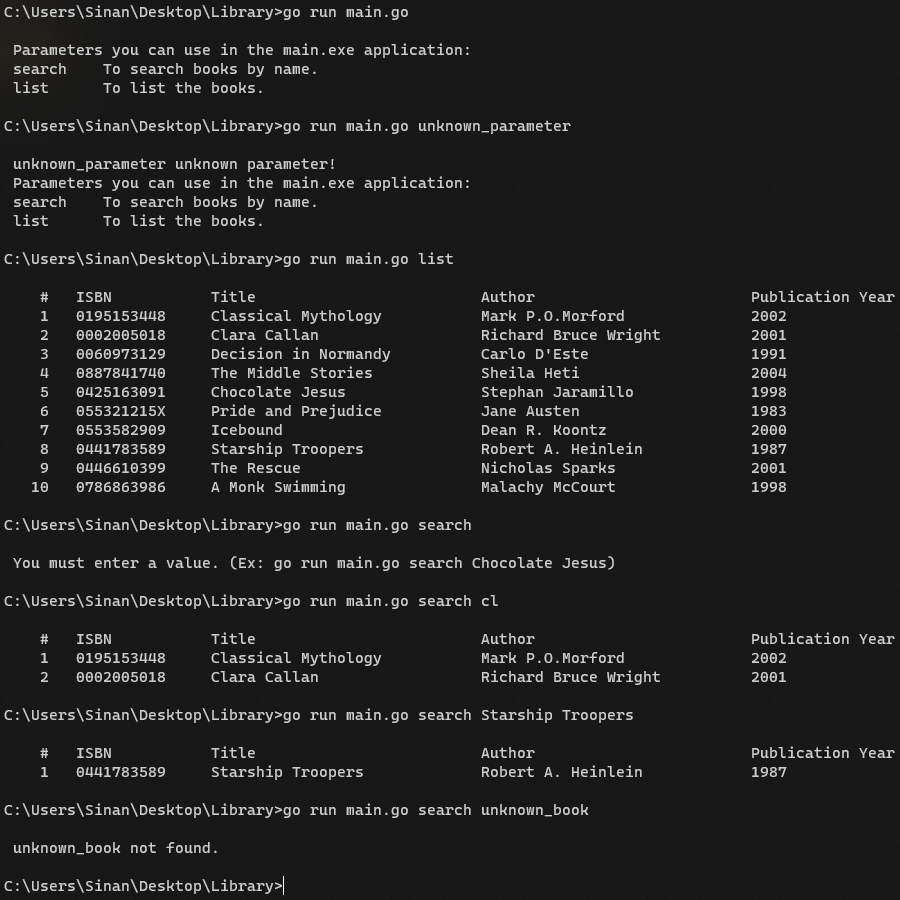

# Go Library App
 

A library application with search and listing features written in Go language.

### Project Structure

```properties
├── helper
│   └── cli.go		-> To manage command line operations.
├── models
│   └── book.go		
├── output
│   └── output.png
├── utils
│   ├── common.go	-> To manage search operations.
│   └── storage.go	-> To manage data operations.
└── main.go		-> To manage operations according to arguments.
```

### Build
+ To create binary file.

	```cmd
	cd <source_code_path> && go build -o Library_1.0.0
	```

### Usage
+ To list all books.
	+ With source code.

		```cmd
		go run main.go list
		```
	+ With binary file.

		```cmd
		Library_1.0.0 list
		```

+ To search within books by book name. You don't need to type the exact title of the book to search.
	+ With source code.

		```cmd
		go run main.go search book_title
		```
		
		```cmd
		go run main.go search boo
		```

	+ With binary file.

		```cmd
		Library_1.0.0 search book_title
		```
		
		```cmd
		Library_1.0.0 search boo
		```	

+ Sample scenario of the application.

	
