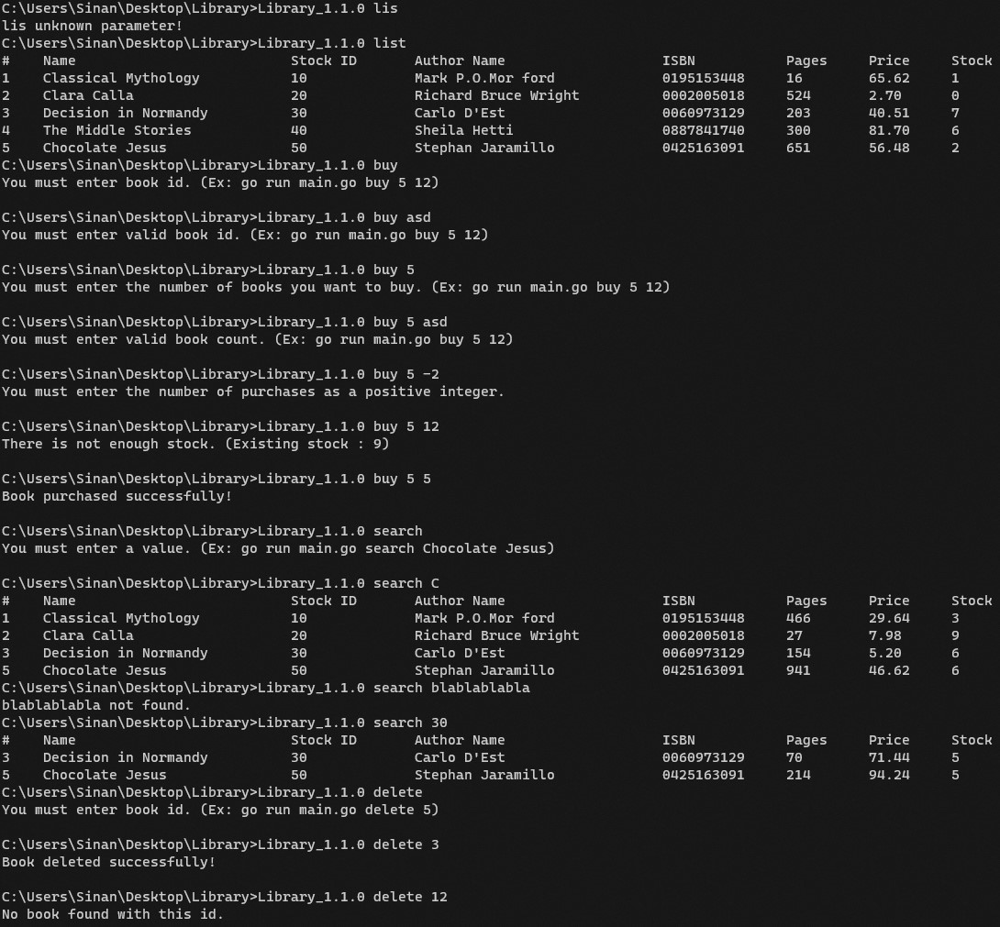

# Go Library App
 

### Author: Sinan Demir
A library application with search and listing features written in Go language.

### Project Structure

```properties
├── models
│   ├── author.go
|   └── book.go		
├── output
│   └── output.png
├── utils
│   └── storage.go	-> To manage data operations.
└── main.go		-> To manage operations according to arguments.
```

### Build
+ To create binary file.

	```cmd
	cd <source_code_path> && go build -o Library_1.1.0.exe
	```

+ Sample scenario of the application.

	
